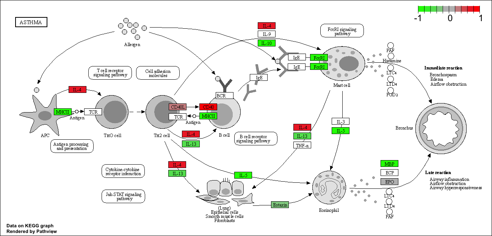

The data for this hands-on session comes from a published RNA-seq experiment where airway smooth muscle cells were treated with dexamethasone, a synthetic glucocorticoid steroid with anti-inflammatory effects (Himes et al. 2014).

## 1 Read the countdata and coldata

We need two things the countdata and coldata (metadata about how the experiment was setup)

```{r}
counts <- read.csv("airway_scaledcounts.csv", row.names=1)
metadata <-  read.csv("airway_metadata.csv")
```

Have a little look see: 

```{r}
head(counts)
```

```{r}
head(metadata)
```

I always need to double check that the columns of my countdata and my coldata (metadata) match. 

```{r}
metadata$id
```
```{r}
colnames(counts)
```

```{r}
metadata$id == colnames(counts)
```

```{r}
all(c(T, T, T, F))
```

I can use the 'all()' function to make sure all my values match (i.e. all values are TRUE)

```{r}
all(metadata$id == colnames(counts))
```

## 2 Extract control and treated counts for comparison

First lets extract the control counts columns

```{r}
#Shows group_names (ids) with "control"
control.ids <- metadata[metadata$dex == "control", ]$id
#Lists control values for the group_names (ids)
control.counts <- counts[, control.ids]
head(control.counts)
```

```{r}
#Take the mean count value per gene (i.e. rows)
control.mean <- rowMeans(control.counts)
head(control.mean)
```


Now do the same thing for the "treated" samples. 

```{r}
treated.id <- metadata[metadata$dex == "treated",]$id
treated.counts <- counts[, treated.id]
treated.mean <- rowMeans(treated.counts)
```

Now we can make a plot comparing treated vs control

```{r}
plot(treated.mean, control.mean)
```

When we see data that is so heavily skewed like this over quite a wide range of values we start to think of log transformations to make our analysis easier. 

```{r}
plot(treated.mean, control.mean, log="xy",
    xlab= "log of drug treated counts",
    ylab= "log of control counts")
```

We are after changes in gene expression: treated vs control and this would represent points (i.e. genes) that do not like on the diagonal. 

We like to work with log 2 values. 
```{r}
log2(20/20)
```

```{r}
log2(10/20)
```

```{r}
log2(80/20)
```

Now let's calculate the log2 fold change 
```{r}
log2fc <- log2(treated.mean/control.mean)
```

Store my work so far 
```{r}
meancounts <- data.frame(control.mean, treated.mean, log2fc)
head(meancounts)
```

Filter our data to remove genes with zero expression values. 
```{r}
z <- data.frame(x=c(10, 0, 30, 40), 
                y=c(10, 0, 30,  0))
z
which(z == 0, arr.ind= TRUE)
```

```{r}
i <- which(z == 0, arr.ind= TRUE)
unique(i[,1])
```

Now do it for our real dataset.
```{r}
zero.vals <- which(meancounts[,1:2]==0, arr.ind=TRUE)

to.rm <- unique(zero.vals[,1])
mycounts <- meancounts[-to.rm,]
head(mycounts)
```

How many genes do we have left?
```{r}
nrow(mycounts)
```


A common threshold used for calling something differentially expressed is a log2(FoldChange) of greater than 2 or less than -2. Let’s filter the dataset both ways to see how many genes are up or down-regulated.

"Up" genes...
```{r}
up.ind <- sum(mycounts$log2fc >2)
up.ind

```

"Down" genes... 
```{r}
down.ind <- sum(mycounts$log2fc < (-2))
down.ind
```

We are missing the stats! Are these differences significants?

# DESeq2 Analysis 

Let’s do this the right way. DESeq2 is an R package specifically for analyzing count-based NGS data like RNA-seq. It is available from Bioconductor. 

```{r}
library(DESeq2)
```

This package wants input in a specific way: 
```{r}
dds <- DESeqDataSetFromMatrix(countData=counts, 
                              colData=metadata, 
                              design=~dex)
dds
```

Now we can run DESeq2 analysis
```{r}
dds <- DESeq(dds)
```

To get the results back in a useful way we can use the 'results()' function.
```{r}
res <- results(dds)
res
```

## Volcano plots
Let’s make a commonly produced visualization from this data, namely a so-called Volcano plot. These summary figures are frequently used to highlight the proportion of genes that are both significantly regulated and display a high fold change.

```{r}
plot( res$log2FoldChange,  res$padj)
```

```{r}
plot( res$log2FoldChange,  -log(res$padj))
```

```{r}
plot( res$log2FoldChange,  -log(res$padj), 
      xlab="Log2(FoldChange)",
      ylab="-Log(P-value)")
abline(h=-log(0.05), col= "gray")
abline(v=c(-2,2), col= "gray")
```

I want to polish this main results figure by adding color to the genes I will focus on the next day.
```{r}
# I will start by making a gray vector for everything
mycols <- rep("gray", nrow(res))

# Now I will overwrite the small pasj values 
mycols[ res$padj < 0.005 ]  <- "red" 

# Now if my log2foldchange is small I will make them gray 
mycols[ abs(res$log2FoldChange) < 2] <- "gray" 

plot( res$log2FoldChange,  -log(res$padj), 
 col=mycols, ylab="-Log(P-value)", xlab="Log2(FoldChange)")

abline(h=-log(0.05), col= "darkgray")
abline(v=c(-2,2), col= "darkgray")
```

# Adding annotation data

To help interpret our results we need to understand what the differentially expressed genes are. A first step here is to get the gene names (i.e. gene SYMBOLs)

For this I will install: 
-BiocManager::install("AnnotationDbi")
-BiocManager::install("org.Hs.eg.db")

```{r}
library("AnnotationDbi")
library("org.Hs.eg.db")
```

What DB identifiers can I look up?
```{r}
columns(org.Hs.eg.db)
```

We will use the 'mapIds()' function to translate between different ids. 
```{r}
res$symbol <- mapIds(org.Hs.eg.db,
                     keys=row.names(res),  # Our genenames
                     keytype="ENSEMBL",    # The format of our genenames
                     column="SYMBOL",      # The new format we want to add
                     multiVals="first")
head(res)
```

>Q11. Q11. Run the mapIds() function two more times to add the Entrez ID and UniProt accession and GENENAME as new columns called res$entrez, res$uniprot and res$genename.

```{r}
res$entrez <- mapIds(org.Hs.eg.db,
                     keys=row.names(res),  # Our genenames
                     keytype="ENSEMBL",    # The format of our genenames
                     column="ENTREZID",      # The new format we want to add
                     multiVals="first")

res$uniprot <- mapIds(org.Hs.eg.db,
                     keys=row.names(res),  # Our genenames
                     keytype="ENSEMBL",    # The format of our genenames
                     column="UNIPROT",      # The new format we want to add
                     multiVals="first")

res$genename <- mapIds(org.Hs.eg.db,
                     keys=row.names(res),  # Our genenames
                     keytype="ENSEMBL",    # The format of our genenames
                     column="GENENAME",      # The new format we want to add
                     multiVals="first")
head(res)
```

# Patway analysis with R and Bioconductor

Here we play with just one, the GAGE package (which stands for Generally Applicable Gene set Enrichment), to do KEGG pathway enrichment analysis on our RNA-seq based differential expression results.

I need to instal the gage package along with the pathview package for generating pathway figures from my results.

BiocManager::install( c("pathview", "gage", "gageData") )

```{r}
library(pathview)
library(gage)
library(gageData)

data(kegg.sets.hs)

# Examine the first 2 pathways in this kegg set for humans
head(kegg.sets.hs, 2)
```

Recall that vectors can have a names attribute that helps with bookkeeping just like colnames and rownames. 
```{r}
x <- c(40, 70, 20)
names(x) <- c("lisa", "xinquiu", "barry")
x
```

We need a vector of fold-change labeled with the names of our genes in ENTREZ format.
```{r}
foldchanges <- res$log2FoldChange
names(foldchanges) <- res$entrez
head(foldchanges)
```

Now we can run the GAGE analysis passing in our foldchange vector and the KEGG genesets we are interested in.
```{r}
# Get the results
keggres <- gage(foldchanges, gsets=kegg.sets.hs)
```

Lets look at the first few down (less) pathway results:
```{r}
# Look at the first three down (less) pathways
head(keggres$less, 3)
```

Now I can map my foldchange results onto any KEGG pathway. I will do this manually first by selecting one of the pathway IDs from above.

```{r}
pathview(gene.data=foldchanges, pathway.id="hsa05310")
```





## Final step save our results
```{r}
write.csv(res, file="deseq_results.csv")
```

